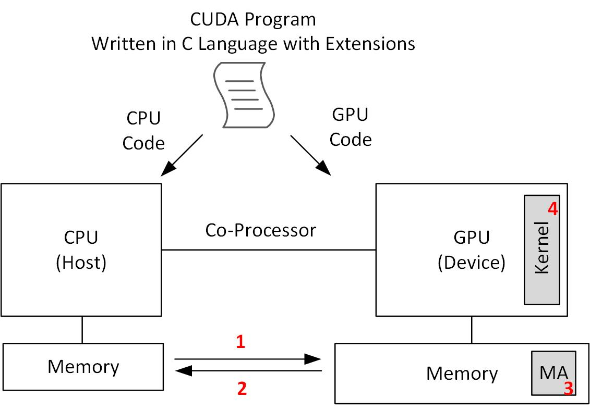

# Parallel Computing with GPGPUs
In this repository, I try to summarize what I review and learn from parallel comptuing with GPGPUs. Special thanks for [Prof. John Owens](https://www.ece.ucdavis.edu/~jowens/) who paved the way of learning parallel computing with GPGPUs with his free course on the Udacity. I develop this course as he taught that time. However, I add more information and examples from other resources.

## Introduction
In this very first section, the story of how computer architects focused their attention on parallel computing is narrated.Then, CUDA platform is described. Finally, a simple CUDA program is shown and described.
### The History
In the words of Thomas Jefferson
> I like the dreams of the future better than the history of the past.

The story starts 1948 (I can barely remember, but I believe you would not be able to remember anything) when Von Neumann architecture became the mainstream of computer architecture. Computer architects were desigining and building computing systems that were fetching data from memories, processing it on CPUs, then writing it back to memories. They encountered several challenges, and tried to find solutions for them. One of the challenges was the processor-memory performance gap referred as [Memory Wall](https://link.springer.com/referenceworkentry/10.1007%2F978-0-387-09766-4_234). Computer architects for addressing this issue focused on architectural techniques like caching, pre-fetching, multi-threding, Processing In-Memory (PIM) to prevent CPUs from stalling (waiting for memories to give them data). The other one was dennard scaling breakdown. Computer architects were not able to improve the performance just by increasing the working frequency of chips. So, they steered the computer architecture trend toward Parallelism. This time instead of complex large processor cores, they were desigining for more simple processors working together. This architecture increased performance, and power efficiency by providing more operations per watt. Indeed, they focused on throughput (on large cores their focus was on latency). The only pitfall of parallel systems was making programmers' lifes harder. It is usually claimed challenging for a programmer, who is used to develop serial programs, to switch to a new thinking paradigm and develop parallel programs!

## Compute Unified Device Architecture (CUDA)
It is a parallel computing platform and API created by NVIDIA allowing developers to use a CUDA-enabled GPU for general purpose processing. This approach is termed as GPGPU (General Purpose GPU). The CUDA platform is a software layer providing a direct access to the GPU's virtual instruction set (PTX) and parallel computational elements, for the execution of kernels which also are called computer kernels. This platform is designed to work with programming languages like C, C++, Fortran. As a result, programming with CUDA is much easier than prior APIs, like Direct3D and OpenGL (demaning advanced skills in graphics programming), to it. OpenCL (Open Computing Language) is a framework providing developers with more capability of writing programs that execute across heterogeneous platforms consisted of CPUs, GPUs, DSPs, FPGAs, and other hardware accelerators.

This repository's goal is working with CUDA platform. For working with this platform on Windows, first, Microsoft Visual Studio Code alongside Nvidia's CUDAtoolkit must be installed. Nvidia Nsight is an application development environment which brings GPU computing into Microsoft Visual Studio allowing developers to build and debug integrated GPU kernels and native CPU code as well as inspect the state of the CPU, GPU, and memory. But, on a Linux OS due to the built-in compilers, only nvcc compiler is enough to compile CUDA programs.

A CUDA program (its extension is .cu) consists of two parts: (1) runs on CPU which is usually called "host", (2) runs on GPU, which is usually called "device". The following figure shows how a cuda program runs on a system consisted of a CPU and a GPU (called Heterogeneous System). When we write a program in C, C++, Python or other programming language, it executes only on the CPU. However, CUDA platform makes us to write one code that will be executed on both CPU and GPU.



A CUDA program, which views GPU as a co-processor of CPU, CPU or "host" is in charge of doing the data movements (transfer) between CPU and GPU memories with **Memcpy** CUDA instruction (1, 2). It also allocates a memory part on GPU's memory with **Memalloc** CUDA instruction (3). Then, CPU launches kernels on GPU to be executed by GPU (4) with three arrow syntax with parameters showing the kernel configuration, which we will be cleared as follows.

Note that:
1. GPU can only respond to CPU requests for sending or receiving data from/ to CPU. Also, it computes a kernel launched by CPU.
2. GPU cannot initiate any data sending/ receiving request.
3. GPU cannot compute a kernel launched by itself or it cannot launch a kernel. In other words, from a kernel another kernel cannot be launched.
4. CPU launches kernels on GPU in the order you write in your code.

### A Typical GPU Program
In a CUDA program, the following list happens:
1. CPU allocates memory on GPU (**cudaMalloc**)
2. CPU copies input data from its memory to GPU's memory (**cudaMemcpy**)
3. CPU launches kernel(s) on GPU to process the input data (copied in the previous step)
4. CPU copies results back to its memory from GPU's memory (**cudaMemcpy**)

The big idea in writing CUDA programs is that kernels look like serial programs as if it will run on thread. The GPU will run that program on many threads because each thread has an id.

Also, note that in GPU computing, throughput is what you will gain from. GPUs are efficient when your program is highly parallel. GPUs are masters of launching a large number of threads efficiently. The data movement part and the parallelism of the program that is going to be processed by GPU should be considered unless totally nothing will be achieved while more energy will be squandered.

### A Simple Program
A simple program aims at computing square of each element of an array.
#### With a CPU
The serial version of it which runs only on a CPU follows:

```c
length_of_array = 1024;
for(int i = 0; i < length_of_array; i++) {
    out[i] = in[i] * in[i];
}
```

In this program, there is no explicit parallelism, so it is executed by a single thread. 1024 multiplications are required for the task completion. If each multiplication takes 2 nanoseconds:

```
Execution time = 1024 * 2 ns = 2048 ns
```

#### With a GPU
In this scenario, CPU will move data between its memory and GPU memory and launch kernel, which impose timing overheads. GPU will launch 1024 threads (degree of parallelism is 1024). Each thread will multiply each array element to itself and put it in the result array. So, Only one multiply time by GPU takes to finish the task because all of the threads will begin their execution simultaneously when the kernel is launched. You can have access to its source code [here](Code/01-simple_program/simple_CUDA_square_each_element_of_an_array/kernel.cu), which is tested in Microsoft VS 2019.

```c
#include <stdio.h>

__global__ void square(float * d_out, float * d_in) {
    int idx = threadIdx.x; // threadIdx is a cuda built-in variable
    float f = d_in[idx];
    d_out[idx] = f * f;
}

int main() {
    const int ARRAY_SIZE = 1024;
    const int ARRAY_BYTES = ARRAY_SIZE * sizeof(float);

    float h_in[ARRAY_SIZE];
    for (int i = 0; i < ARRAY_SIZE; i++) {
        h_in[i] = float(i);
    }
    float h_out[ARRAY_SIZE];

    float * d_in;
    float * d_out;

    cudaMalloc((void **) &d_in, ARRAY_BYTES);
    cudaMalloc((void **) &d_out, ARRAY_BYTES);

    cudaMemcpy(d_in, h_in, ARRAY_BYTES, cudaMemcpyHostToDevice);

    square<<<1, ARRAY_SIZE>>>(d_out, d_in);

    cudaMemcpy(h_out, d_out, ARRAY_BYTES, cudaMemcpyDeviceToHost);

    cudaFree(d_in);
    cudaFree(d_out);

    return 0;
}
```

If each multiplication by GPU takes 10 nanoseconds and there are some overheads imposed by data transfer and kernel launching.

```
Execution Time = 10 ns + 2 * DT Overhead + L Overhead 
```

As it is evident, if the data transfer overhead is negligible compared to the parallelism, we can gain a lot from GPU computing.

We will learn more about the kernel, its configuration, especially about thread blocks, number of threads in a block, and cuda built-in variables for addressing threads on GPU. For now, it is enough to know that in kernel launching the first argument shows the number of thread blocks, and the second one shows the number of threads per thread block. **dim3** can be used to describe the dimension of blocks and threads. The general kernel launch looks like the following snippet:

```c
kernel_name<<<dim3(Dx, Dy, Dz), dim3(Tx, Ty, Tz), shmem>>>(argment list);
```

**shmem** shows the shared memory per block in bytes.

The following list briefly introduces you the built-in variables of CUDA for addressing threads and blocks:

1. threadIdx: thread within block - threadIdx.x, threadIdx.y
2. blockDim.x, .y, .z: size of a block (# of threads in a block) in a particular dimension
3. blockIdx: block id within grid
4. gridDim.x, .y, .z: size of grid (# of blocks in it) in a particular direction

In the following example: our kernel is consisted of 8 blocks, each containing 64 threads. Totally, the kernel consists of 64 * 8 = 512

```c
kernel_name<<<dim3(2, 2, 2), dim3(4, 4, 4)>>>(argment list);
```
Note: for calculating the data transfer time overhead between CPU and GPU, [NVIDIA Nsight Systems tool](https://developer.nvidia.com/nsight-systems) can be used.

### Grayscale Filter
In this example, a grayscale image processing filter is developed. It inputs a color image and changes it to a black and white image. First, how images are shown is reviewd.

An image is represented by three values well-known for RGB, which stands for Red, Green, Blue. RGB = (0, 0, 0) represents white, and RGB = (255, 255, 255) represents black. Also, there is another element which shows the transparency, which is called alpha channel. In C language a pixel can be shown as follows:

```c
struct uchar4 {
    // RED
    unsigned char x;

    // Green
    unsigned char y;

    // Blue
    unsigned char z;

    // ALPHA
    unsigned char w;
}
```

For converting a color image to a grayscale one, simple naive way would be use the average of Red, Green, and Blue channels. But, image processing experts suggest the following formula, so we will use it.

```
I = 0.299 * R + 0.587 * G + 0.114 * B
```

You can find the source code of this example [here](Code/02-grayscale_filter/grayscale_filter). This is the project given on the course. For working with this, you have to install opencv, also do a lot of configurations to your VS IDE to run it. I developed a simpler version of this filter and it can be found [here]().

Note: for being able to run the project, the following is needed:
1. How to install opencv and use it in Microsoft VS [click here](https://subwaymatch.medium.com/adding-opencv-4-2-0-to-visual-studio-2019-project-in-windows-using-pre-built-binaries-93a851ed6141)
2. How to give arguments to our program in Microsoft VS [click here](https://social.msdn.microsoft.com/Forums/vstudio/en-US/33160a80-d2fa-4af2-a5d5-14b8696df702/argc-and-argv-in-visual-c?forum=vcgeneral)