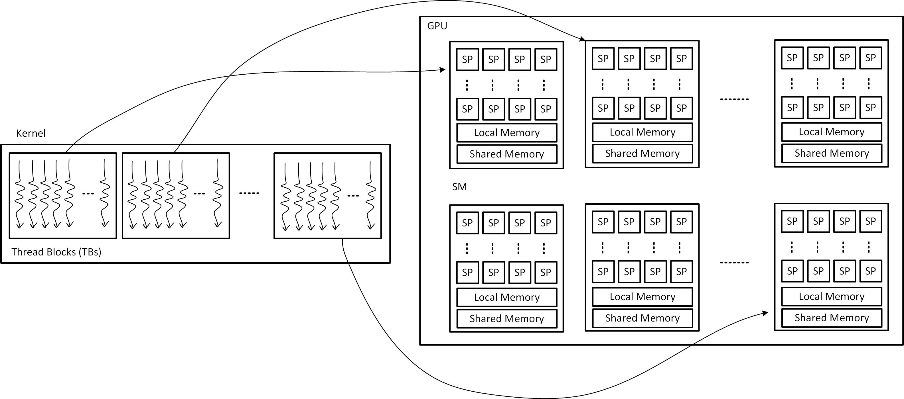
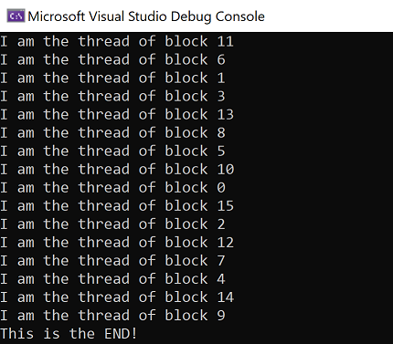
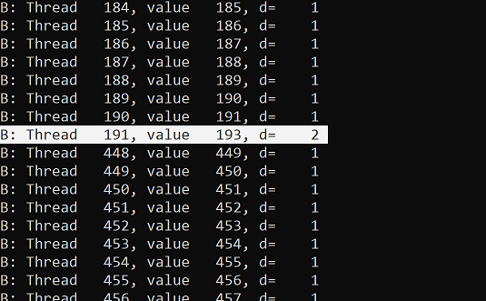

# Parallel Computing with GPGPUs
In this repository, I try to summarize what I review and learn from parallel comptuing with GPGPUs. Special thanks to [Prof. John Owens](https://www.ece.ucdavis.edu/~jowens/) and [David P. Luebke](https://luebke.us/) who paved the way of learning parallel computing with GPGPUs with his free course on the Udacity. I develop this course as he taught that time. However, I add more information and examples from other resources.

## Introduction
In this very first section, the story of how computer architects focused their attention on parallel computing is narrated. Then, the CUDA platform is described. Finally, a simple CUDA program is shown and described.

### The History
In the words of Thomas Jefferson
> I like the dreams of the future better than the history of the past.

The story begins 1948 (I can barely remember something :D, but I believe you would not be able to remember anything) when Von Neumann architecture became the mainstream of computer architecture. Computer architects were desigining and building computing systems that were fetching data from memory units, processing it in CPUs, then writing it back to memory units. They encountered several challenges, and tried to find solutions for them. One of the challenges was the processor-memory performance gap referred as [Memory Wall](https://link.springer.com/referenceworkentry/10.1007%2F978-0-387-09766-4_234). Computer architects for addressing this issue focused on architectural techniques like caching, pre-fetching, multi-threding, Processing In-Memory (PIM) to prevent CPUs from stalling (waiting for memories to give them data). The other one was dennard scaling breakdown. Computer architects were not able to improve the performance just by increasing the working frequency of chips. So, they steered the computer architecture trend toward **parallelism**. This time instead of complex large processor cores, they were desigining for more simple processors working together. This architecture increased performance, and power efficiency by providing more operations per watt. Indeed, they focused on throughput (on large cores their focus was on latency). The only pitfall of parallel systems was making programmers' lifes harder. It is usually claimed challenging for a programmer, who is used to develop serial programs, to switch to a new thinking paradigm and develop parallel programs!
This amount of history to know why we are here is enough!

In the words of Henry Glassie
> History is not the past but a map of the past, drawn from a particular point of view, to be useful to the modern traveller.


## Compute Unified Device Architecture (CUDA)
It is a parallel computing platform and API created by NVIDIA allowing developers to use a CUDA-enabled GPU for general purpose processing. This approach is termed as GPGPU (General Purpose GPU). The CUDA platform is a software layer providing a direct access to the GPU's virtual instruction set (**PTX**) and parallel computational elements, for the execution of kernels which also are called compute kernels. This platform is designed to work with programming languages like C, C++, Fortran. As a result, programming with CUDA is much easier than prior APIs, like **Direct3D** and **OpenGL** (demaning advanced skills in graphics programming), to it. **OpenCL** (Open Computing Language) is a framework providing developers with more capability of writing programs that execute across heterogeneous platforms consisted of CPUs, GPUs, DSPs, FPGAs, and other hardware accelerators.

This repository's goal is working with CUDA platform. For working with this platform on Windows, first, Microsoft Visual Studio Code alongside Nvidia's CUDAtoolkit must be installed. Nvidia Nsight is an application development environment which brings GPU computing into Microsoft Visual Studio allowing developers to build and debug integrated GPU kernels and native CPU code as well as inspect the state of the CPU, GPU, and memory. But, on a Linux OS due to the built-in compilers, only nvcc compiler is enough to compile CUDA programs.

A CUDA program (its extension is **.cu**) consists of two parts: (1) runs on CPU which is usually called "**host**", (2) runs on GPU, which is usually called "**device**". The following figure shows how a cuda program runs on a system consisted of a CPU and a GPU (called Heterogeneous System). When we write a program in C, C++, Python or other programming language, it executes only on the CPU. However, CUDA platform makes us to write one code that will be executed on both CPU and GPU.


A CUDA program, which views GPU as a co-processor of CPU, CPU or "host" is in charge of doing the data movements (transfer) between CPU and GPU memories with **Memcpy** CUDA instruction (1, 2). It also allocates a memory part on GPU's memory with **Memalloc** CUDA instruction (3). Then, CPU launches kernels on GPU to be executed by GPU (4) with three arrow syntax with parameters showing the kernel configuration, which we will be cleared as follows.

Note that:
1. GPU can only respond to CPU requests for sending or receiving data from/ to CPU. Also, it computes a kernel launched by CPU.
2. GPU cannot initiate any data sending/ receiving request.
3. GPU cannot compute a kernel launched by itself or it cannot launch a kernel. In other words, from a kernel another kernel cannot be launched.
4. CPU launches kernels on GPU in the order you write in your code.

### A Typical GPU Program
In a CUDA program, the following list happens:
1. CPU allocates memory on GPU (**cudaMalloc**)
2. CPU copies input data from its memory to GPU's memory (**cudaMemcpy**)
3. CPU launches kernel(s) on GPU to process the input data (copied in the previous step)
4. CPU copies results back to its memory from GPU's memory (**cudaMemcpy**)

The big idea in writing CUDA programs is that kernels look like serial programs as if it will run on thread. **The GPU will run that program on many threads because each thread has an id**.

Also, note that in GPU computing, **throughput** is what you will gain from. GPUs are efficient when your program is highly parallel. GPUs are masters of launching a large number of threads efficiently. The data movement part and the parallelism of the program that is going to be processed by GPU should be considered unless totally nothing will be achieved while more energy will be squandered.

### A Simple Program
A simple program aims at computing square of each element of an array.
#### With a CPU
The serial version of it which runs only on a CPU follows:

```c
length_of_array = 1024;
for(int i = 0; i < length_of_array; i++) {
    out[i] = in[i] * in[i];
}
```

In this program, there is no explicit parallelism, so it is executed by a single thread. 1024 multiplications are required for the task completion. If each multiplication takes 2 nanoseconds:

```
Execution time = 1024 * 2 ns = 2048 ns
```

#### With a GPU
In this scenario, CPU will move data between its memory and GPU memory and launch kernel, which impose timing overheads. GPU will launch 1024 threads (degree of parallelism is 1024). Each thread will multiply each array element to itself and put it in the result array. So, Only one multiply time by GPU takes to finish the task because all of the threads will begin their execution simultaneously when the kernel is launched. You can have access to its source code [here](Code/01-simple_program/simple_CUDA_square_each_element_of_an_array/kernel.cu), which is tested in Microsoft VS 2019.

```c
#include <stdio.h>

__global__ void square(float * d_out, float * d_in) {
    int idx = threadIdx.x; // threadIdx is a cuda built-in variable
    float f = d_in[idx];
    d_out[idx] = f * f;
}

int main() {
    const int ARRAY_SIZE = 1024;
    const int ARRAY_BYTES = ARRAY_SIZE * sizeof(float);

    float h_in[ARRAY_SIZE];
    for (int i = 0; i < ARRAY_SIZE; i++) {
        h_in[i] = float(i);
    }
    float h_out[ARRAY_SIZE];

    float * d_in;
    float * d_out;

    cudaMalloc((void **) &d_in, ARRAY_BYTES);
    cudaMalloc((void **) &d_out, ARRAY_BYTES);

    cudaMemcpy(d_in, h_in, ARRAY_BYTES, cudaMemcpyHostToDevice);

    square<<<1, ARRAY_SIZE>>>(d_out, d_in);

    cudaMemcpy(h_out, d_out, ARRAY_BYTES, cudaMemcpyDeviceToHost);

    cudaFree(d_in);
    cudaFree(d_out);

    return 0;
}
```

If each multiplication by GPU takes 10 nanoseconds and there are some overheads imposed by data transfer and kernel launching.

```
Execution Time = 10 ns + 2 * (Data Transfer Overhead) + (Kernel Launch Overhead) 
```

As it is evident, if the data transfer overhead is negligible compared to the parallelism, we can gain a lot from GPU computing.

We will learn more about the kernel, its configuration, especially about thread blocks, number of threads in a block, and cuda built-in variables for addressing threads on GPU. For now, it is enough to know that in kernel launching the first argument shows the number of thread blocks, and the second one shows the number of threads per thread block. **dim3** can be used to describe the dimension of blocks and threads. The general kernel launch looks like the following snippet:

```c
kernel_name<<<dim3(Dx, Dy, Dz), dim3(Tx, Ty, Tz), shmem>>>(argment list);
```

**shmem** shows the shared memory per block in **bytes**.

The following list briefly introduces you the built-in variables of CUDA for addressing threads and blocks:

1. **threadIdx**: thread within block - **threadIdx.x**, **threadIdx.y**, **threadIdx.z**
2. **blockDim.x, .y, .z**: size of a block (# of threads in a block) in a particular dimension
3. **blockIdx.x, .y, .z**: block id within grid
4. **gridDim.x, .y, .z**: size of grid (# of blocks in it) in a particular direction

In the following example: our kernel is consisted of **8 blocks** (2 * 2 * 2), each containing **64 threads** (4 * 4 * 4). Totally, the kernel consists of **64 * 8 = 512 threads**.

```c
kernel_name<<<dim3(2, 2, 2), dim3(4, 4, 4)>>>(argment list);
```

Note: for calculating the data transfer time overhead between CPU and GPU, [NVIDIA Nsight Systems tool](https://developer.nvidia.com/nsight-systems) can be used.


### Grayscale Filter
In this example, a grayscale image processing filter is developed. It inputs a color image and changes it to a black and white image. First, how images are shown is reviewd.

An image is represented by three values well-known for RGB, which stands for Red, Green, Blue. RGB = (0, 0, 0) represents white, and RGB = (255, 255, 255) represents black. Also, there is another element which shows the transparency, which is called **alpha channel**. In C language a pixel can be shown as follows:

```c
struct uchar4 {
    // RED
    unsigned char x;

    // Green
    unsigned char y;

    // Blue
    unsigned char z;

    // ALPHA
    unsigned char w;
}
```

For converting a color image to a grayscale one, simple naive way would be use the average of Red, Green, and Blue channels. But, image processing experts suggest the following formula, so we will use it.

```
I = 0.299 * R + 0.587 * G + 0.114 * B
```

You can find the source code of this example [here](Code/02-grayscale_filter/grayscale_filter). This is the project given on the course. For working with this, you have to install opencv, also do configurations to your VS IDE to run it. I developed a simpler version of this filter and it can be found [here](Code/02-grayscale_filter/simpler_grayscale_filter).

Note: for being able to run the project, the following links can be helpful:
1. How to install opencv and use it in Microsoft VS [click here](https://subwaymatch.medium.com/adding-opencv-4-2-0-to-visual-studio-2019-project-in-windows-using-pre-built-binaries-93a851ed6141)
2. How to give arguments to our program in Microsoft VS [click here](https://social.msdn.microsoft.com/Forums/vstudio/en-US/33160a80-d2fa-4af2-a5d5-14b8696df702/argc-and-argv-in-visual-c?forum=vcgeneral)


## GPU Hardware and Parallel Communcation Patterns
Parallel computing is about many threads solving a problem by working together. The key to working together is **communication**. In CUDA, communication takes place through memory.

There are different kinds of parallel communication patterns and they are about how to map tasks (threads) and memory. Important communication patterns are listed as follows:


1. **Map**: Tasks read from and write to specific data elements. In this pattern, there is an one-to-one correspondence between input and output. The following figure shows this pattern.


2. **Gather**: A good example and representation, as shown in the following figure, can be the average of three elements of an array which finally end in one element of the output array. A good practical example would be the image bluring in which neighboring pixels of a pixel are averaged with its value. 


3. **Scatter**: **tasks compute where to write output**. A good example and representation of this pattern would be adding a fraction (about 1/4 of its value) of a pixel value to its neighboring pixels. The following figure shows this pattern. Note that just two threads are shown to clearly demonstrate the pattern. Another example is sorting numbers in an array because each thread will compute where to write its output.

Note: the problem of scatter pattern would be attempt of several threads on writing to a same memory location simultaneously.


4. **Stencil**: tasks read input from a fixed neighborhood in an array. As a result, there are a lot of data reuse. **Each element in a stencil is accessed to the same number of elements of that stencil**. 2D ann 3D Von neumann and 2D Moore stencil patterns are examples for stencil.

2D Von Neumann Stencil Pattern


3D Von Neumann Stencil Pattern


2D Moore Stencil Pattern


5. **Transpose**: task reorder data elements in memory. A good example for this pattern is transposing a 2D array or matrix. There is a one-to-one correspondence between input and output. For easily remembering this pattern, recall matrix transpose that we change the columns and rows. The operations required to accomplish that task is a transpose communication pattern.

In the following snippet, you can see differnet communication patterns:

```c
float out[], in[];
int i = threadIdx.x;
int j = threadIdx.y;

const float pi = 3.1415;

out[i] = pi * in[i]; // Map pattern because every single output element is in a correpondence to a unique input element


out[i + j * 128] = in[j + i * 128]; // Transpose pattern because this task reorders data elements in memory, row is changing to a column

if (i % 2 == 0) {
    out[i - 1] += pi * in[i]; 
    out[i + 1] += pi * in[i];
    // Scatter pattern because scatters in[i] on out[i - 1] and out[i + 1]

    out[i] = (in[i] + in[i - 1] + in[i + 1]) * pi / 3.0f;
    // Gather operation because this task gathers in[i], in[i - 1] and in[i + 1] on out[i] 
}
```
 The following figure shows the communication patterns.

 

 ### GPU Hardware
 On the summary of CUDA programming model (what a programmer sees of GPU), The main job of a CUDA programmer is to divide a task into smaller computational kernels. In CUDA, a kernel, as seen before, is a C/C++ function and it will be performed by many threads. A thread is a path of execution through the source code, and different threads take different paths on a source code based on the conditions of conditional statementes like if, switch, and loops. In CUDA, threads are grouped into thread blocks. In a thread block, threads cooperate to solve a sub-problem. The higher level of thread block is thread gird or kernel.

 In a high level, a GPU is made of several **Streaming Multiprocessors (SMs)**. Different GPU have different number of SMs. Each SM has many simple processors (Called **Streaming Processors (SPs)**) that can run a number of parallel threads. GPU (**GigaThread unit**) is responsible for allocating thread blocks (TBs) to streaming multiprocessors (SMs). All of the SMs run in parallel and independently. The following figure would give a clear idea of the all above.

 

 Note that when a kernel encompassing several thread blocks is launched, there is no guarantee about the execution order of thread blocks. Also, programmer cannot determine which SM will execute which thread block. However, CUDA makes few guarantees about when and where thread blocks will run:
 1. Hardware runs things efficiently because of the flexibility provided for it.
 2. No waiting on filling SMs with TBs.
 3. Scalability comes as a result of no force of where and whent a specific TB will be executed.

**Note**: There is no communication between thread blocks (TBs).

The following example demonstrates how 16 thread blocks with one thread in each of them can result in 16! different outcomes. The source code can be found [here](Code/03-execution_order/execution_order/kernel.cu).

```c
#include <stdio.h>

#define NUM_BLOCKS 16
#define BLOCK_WIDTH 1

_global__ void hello() {
    printf("I'm the thread in block %d", blockIdx.x);
}

int main() {
    // kernel launch
    hello<<<NUM_BLOCKS, BLOCK_WIDTH>>>();

    // forcing the printf()s to flush
    cudaDeviceSynchronize();

    printf("This is the end!");
    return 0;
}
```

The output of different executions.




CUDA guarantees that:
1. All threads in a block run on the same SM at the same time
2. All blocks in a kernel finish before any blocks from the next kernel runs


### Memory Model
Every thread has access to its local memory which is used for storing its local private variables. Threads of a thread block share a memory called ""shared memory". Every thread in entire system reads and writes at any time to global memory. The GPU's memory, which data is copied from CPU's memory to it, is the global memory.


Following statements from a quiz all are true, which can give a better understanding of the memory model of GPU:


1. All threads from a block can access the same variable in that thread block's shared memory.
2. Threads from two different blocks can access the same variable in global memory.
3. Threads from different thread blocks have their own copy of local varaibles in local memory.
4. Threads from the same thread block have their own copy of local variables in local memory.

The following figure can give a good idea of memory model in CUDA programming.


As it is evident from this memory model, threads can access each other's results throguh shared and global memory, and in this way they can work (or talk) together. But, what happens if a thread reads a result before another one writes? So, there is needed a way of **synchronization**!

The simplest form of synchronization is using "**barriers**". A barrier is a point in the program where threads stop and wait, and when all threads have reached the barrier, they can proceed. The following snippet shows the need for barriers. The source code can be found [here](Code/04-need_for_barriers/code_with_barriers/need_for_barriers/kernel.cu).


```c
  int idx = threadIdx.x;
    int r1, r2, res_diff;
    __shared__ int arr[512];
    arr[idx] = idx;
    printf("A: Thread %5d, value %5d\n", idx, arr[idx]);
    __syncthreads();
    r1 = arr[idx];

    if (idx < 511) {
        int temp = arr[idx + 1];
        __syncthreads();
        arr[idx] = temp;
    }
    r2 = arr[idx];
    res_diff = r2 - r1;
    printf("B: Thread %5d, value %5d, diff=%5d\n", idx, arr[idx], res_diff);
}

int main()
{
    aKernel<<<1, 512>>> ();
    return 0;
}
```

But, if no barriers were used the result would be random like what is shown in the following figure which is the output of [this source code](Code/04-need_for_barriers/code_with_barriers/no_synchronization_mess/no_synchronization_mess/kernel.cu) in which no __syncthreads() instruction is used.



**Note** that syncthreads() is used just for synchronization of threads in a thread block.

It is recommended to do some experiments in theses phase as this tutorial continues because the best way of learning these things is by doing them. Also, try to change the provided source codes. Any commnets, or suggestions are well appreciated.


#### Writing Efficient Programs
The high-level strategy for writing efficient programs with CUDA is **to maximize arithmetic intensity**. *It means to maximize compute operations per thread, and minimize time spent on memory accesses per thread*.


##### Moving frequently-accessed data to fast memory
One of the ways to minimize time spent on memory is to move frequently-accessed data to fast memory. It is considered that **local memory (Registers or L1 cache)** is faster than shared memory, and they both together are much faster than global memory. The following snippets shows how variables are stored locally or globally.


```c
__global__ void use_local_memory_GPU(float in) {
    float f; // variable "f" is in local memory and private to each thread
    f = in; // parameter "in" is in local memory and private to each thread
}

int main(int argc, char **argv) {
    use_local_memory_GPU<<<1, 128>>>(2.0f);
}
```

```c
__global__ void use_global_memory_GPU(float *arr) {
    arr[threadIdx.x] 2.0f * (float) threadIdx.x;
}

int main(int argc, char **argv) {
    float h_arr[128]; // h stands for host CPU
    float *d_arr; // d stands for Device GPU

    // allocating global memory on the device, placing the result in "d_arr"
    cudaMalloc((void **) &d_arr, sizeof(float) * 128);

    // copying from CPU's memory to GPU's memory
    cudaMemcpy((void *) d_arr, (void *) h_arr, sizeof(float) * 128, cudaMemcpyHostToDevice);

    // launching a kernel with 1 block of 128 threads
    use_global_memory_GPU<<<1, 128>>>(d_arr);

    // copying from GPU's memory to CPU's memory
    cudaMemcpy((void *) h_arr, (void *) d_arr, sizeof(float) * 128, cudaMemcpyDeviceToHost);

    return 0;
}
```


In the following example, it is shown how variables are stored on GPU's shared memory. This memory is shared by all threads of a thread block (TB). Earlier in the barrier example, it is shown how a variable is stored in shared memory by using __shared__ tag. 


```c
// it must be launched with 128 threads
__global__ void use_shared_memory_GPU(float *arr) {
    int i, index = threadIdx.x;
    float average, sum = 0.0f;
    
    // __shared__ variables are visible to all threads in the thread block, and have the same lifetime as the thread block
    __shared__ float sh_arr[128]; // sh stand for shared

    // copying from global memory to shared memory
    // each thread copies one element
    // first the thread brings that shared element into its local memory (registers), then moves it into shared memory
    sh_arr[index] = arr[index];

    // ensures all the writes to shared memory have completed
    __syncthreads();

    // averaging of all previous elements
    for(i = 0; i < index; i++) {
        sum += sh_arr[index];
    }
    average = sum / (float) index;

    if(arr[index] > average) {
        arr[index] = average;
    }

    // the following code has No Effect
    // it modifies data but it never copies that data back to global memory
    // so the results vanishes when the thread block completes
    sh_arr[index] = 3.14;
}
```

Note that if the data processed on shared is not copied to global memory when the thread block finishes the data will be gone because **the lifetime of shared data of a thread block is till the end of that thread block's lifetime**.

Scalar variables like what define are stored in register file of GPU, and read/ write access to them is super fast. The lifetime of that variable is equal to the thread's lifetime.


```c
int var;
```

Arrays defined without qualifier are stored in local memory of a thread and is private to that thread. The lifetime of that array is equal to the thread's lifetime. It passes through memory hierarchy and read/write access to it could penalize the performance.

```c
int array_var[10];
```

##### Using coalesced global memory access
GPU operates most efficient when threads read/ write contiguous (next or together in sequence) memory locations of global memory. The following figure shows how coalesced global memory accesses results in higher performance by reducing the number of memory transactions for feeding the threads with data to work on.


Pay attention at the access pattern of some statements in the following snippet.


```c
__global__ void aKernel(float *g){
    float a = 3.1415;
    int i = threadIdx.x;

    g[i] = a; // coalesced access pattern

    g[i * 2] a; // strided access pattern

    a = g[i]; // coalesced

    a = g[blockDim.x/ 2 + i]; // coalesced

    g[i] = a * g[blockDim.x/ 2 + i] // coalesced

    g[blockDim.x - 1 - i] = a; // coalesced
}
```

#### **Problem**: when several threads write a single memory location

In this way, random result will show up because many thread simultaneously will read stale data. This [example](Code/05-many_threads_accessing_single_mem_location_problem/many_threads_accessing_problem/kernel.cu) shows this problem. The following figures show the random results of incrementing 10 elements of an array with one million threads. 


One solution to this problem is using barriers, **__syncthreads()** with changes to the source code. The other solution is **atomicAdd()**. This instruction is from atomic instructions that GPU implement to meet this problem. Some other atomic instructions are:
1. atomicAdd()
2. atomicMin()
3. atomicXOR()
4. atomicCAS(): **Atomic Compare And Swap**. It can help on developing customized atomic operations that are provided by CUDA.

If you look at [this one](Code/05-many_threads_accessing_single_mem_location_problem/solved_with_atomicAdd\solved_with_atomicAdd/kernel.cu), you will figure out how atomicAdd solves the problem, and the following figures show the correct execution of this one.


The limitations of atomic operations:
- Only certain operations and data types (mostly int) are supported (But it is possible to implement our desired atomic operation with the help of **atomicCAS()**)
- No ordering constraints
  - Floating-point arithmetic non-associative (**a + (b + c) != (a + b) + c**), it is a result of the fact computers are completely precise when it comes to infinitesimal values like 10<sup>-20</sup>
- Serializing accesses to memory ends in harsh performance degradation

##### Programming Exercise
Modify the example code to:
1. 10 <sup>6</sup> threads incrementing 10 <sup>6</sup> elements
2. 10 <sup>6</sup> threads atomically incrementing 10 <sup>6</sup> elements
3. 10 <sup>6</sup> threads incrementing 100 threads
4. 10 <sup>6</sup> threads atomically incrementing 100 elements
5. 10 <sup>7</sup> threads atomically incrementing 100 elements

Which ones produce correct answer? and which one is the slowest and which one is the fastest one?

The reason for the fastest one is that GPU cache can catch the accesses.

#### Avoiding Thread Divergence on Writing Efficient CUDA Programs
Threads diverge on conditional structures of the source code on execution.

In this section, we reviewed communication patterns, GPU hardware and programming model. Then, on writing efficient CUDA programs we reviewed accessing memory faster by using faster memories and coalesing accesses to the global memory. Also, we learned that avoiding thread divergence is another way of writing efficient CUDA programs.


### Bluring Images Programming Assignment
You can see the project [here](Code/06-image_bluring_filter/image_bluring_filter). It is modified, and its errors are fixed, and is successfully tested on Microsoft VS 2019. For being able to run this, you have to have the same setup (opencv must be added to configurations).

What are needed to be done are listed below:
1. Write the blur kernel
2. Write kernel to seperate color image to R, G, B channels
3. Allocate memory for the filter
4. Set grid and block size

Because these programming assignment contain code for evaluating the result by serial CPU code, the entire assignment looks bulky. A simpler version which implements a image blur filter can be found [here](Code/6-image_bluring_filter/simpler_image_bluring_filter).


## Fundamentals of GPU Algorithms
Discussing GPU parallel algorithms requires knowledge on two costs: Step and Work Complexities

The following figure shows an example.


The step and work complexities are used to compare against the step and work complexity for a serial implementation. It is concluded that a parallel algorithm is work-efficient if its work complexity is asymptotically the same (within a constant factor as the work complexity of the sequential algorithm). If the step complexity of a parallel algorithm is less than a step complexity of a serial algorithm while having a reasonable work complexity that is not too expensive, the parallel algorithm will have faster runtime.


### Reduce Algorithm
An example of reduce algorithm is reducing a set of numbers, for example, adding up all the numbers of a set to get a total sum. This algorithm demands cooperation between processors. The following figure shows a good this algorithm:


Reduce algorithm has two inputs:
1. Set of elements
2. Reduction operator (It must be **binary** and **associative** like add, multiply)

Example: **REDUCE[(1, 2, 3, 4), +] => 50**

#### Serial code of reduce:

```c
int reduce(int *arr, int array_length)
{
    sum = 0;
    for(int i = 0; i < array_length; i ++) {
        sum += arr[i];
    }
    return sum;
}
```

The step and work complexity of serial reduce algorithm:
1. Step Complexity: **O(n)** - It need n-1 steps
2. Work Complexity: **O(n)** - In each step, there is just one operation

#### Parallel Version of Reduce
The following figure shows how by changing the associativity of operands in expresssion, the parallel version can be generated.


The step and work complexities of parallel reduce are:
1. Step Complexity: **O(log(n))**
2. Work Complexity: **O(n)**


### Scan Algorithm
An example for this algorithm is calculating the sum of all element till the index the current value of the pointer has.

- input - 1 2 3 4 5 6 7 8 9 10
- output - 1 3 6 10 15 21 28 36 45 55

- Scan is not useful in serial world, but it is very useful in parallel computing

Inclusive and exclusive scans: in inclusive scan all elements are involved in the operation and the final result is what we need to decide on. However, exclusive scan start with identity value as the first calculated output and the final element is not involved in the results.

Inclusive Example:

- input - 1 2 3 4 5 6 7 8 9 10
- output - 1 3 6 10 15 21 28 36 45 55


Exclusive Example:

- input - 1 2 3 4 5 6 7 8 9 10
- output - 0 1 3 6 10 15 21 28 36 45


Inclusive reduce:

```c
int acc = identity_element;

for (i = 0; i < elements.length(); i++) {
    acc = acc (op) elements[i];
    out[i] = acc;
}
```

exclusive reduce

```c
int acc = identity_element;

for (i = 0; i < elements.length(); i++) {
    out[i] = acc;
    acc = acc (op) elements[i];
}
```

for scan, we have:
- step complexity: **O(logn)**
- work complexity: **O(n<sup>2</sup>)**

## Two Paralllel Scan Algorithms

### Hillis & Steele Algorithm (**Step Efficient**)
An example of Hillus and Steele algorithm is given - **it is an inclusive sum scan** - in the following figure. Remember that on step 0, starting from the last element, each element is added to it neighbor specified with **2<sup>step</sup>**. If an element does not have a neighbor on its left side, the calculation is not accomplished and its value is passed down.


- Work Complexity: **O(nlogn)**
- Step Complexity: **O(logn)**

### Belloch Algorithm (**Work Efficient**)
This algorithm introduces a new operation called: **downsweep**. Downsweep receives two inputs and produces two outputs (the right hand input is copied, the result of operation on two is another result) as the following figure shows.


Here, there is an example of exclusive Belloch algorithm. Belloch algorithm is composed of two overall steps. First step is reduce, the other one is downsweep.


**Note**: remember that Hillis&Steele and Belloch algorithms are for parallelizing the scan algorithm. Remember that if looks very serial by its cover.

Another example of Belloch algorithm, the operator is max scan.


- Work complexity: **O(n) (reduce)** + **O(n) (downsweep)**
- Step complexity: **O(logn) (reduce)** + **O(logn) (downsweep)**

## Histogram Algortihm

A good example for understanding the histogram algorithm is how we process the population of a city and put them into different categories or bins based on their age like infant (age < 1 year), toddler (1 <= age < 2), child (2 <= age < 12), teen (12 <= age <= 18), youth (18 < age < 32), middle-aged (32 <= age <= 50), elderly (age > 50). We can count the number of people in each category and make a figure like as follows.


If we want to find the cumulative distribution function (CDF) from the histogram we made, we need to do a "**exclusive scan**" operation.

**Serial implementation** of histogram algorithm:

```c
BIN_COUNT = 7; // 7 is just an example


float data_array[1000]; // 1000 is just an example - It contains the raw or measurement data

int compute_bin(float in) {
    // This is just an example on how this function can be
    if(in >= 0 && in < 1)
        return 0;
    else if (in >= 1 && in < 2)
        return 1;
    else if (in >= 2 && in < 12)
        return 2;
    else if (in >= 12 && in <= 18)
        return 3;
    else if (in > 18 && in < 32)
        return 4;
    else if (in >= 32 && in <= 50)
        return 5;
    else
        return 6;
}

// Initializing bins to zero
for (i = 0; i < BIN_COUNT; i++) {
    result[i] = 0;
}

// going over each element in the data array and increasing the right counter
for (i = 0; i < DATA_ARRAY_LENGTH; i++){
    result[compute_bin(data_array[i])]++;
}
```

### Parallel implementation of histogram algorithm
If we want to launch threads to the number of raw data and increase the bin counter, **race condition** happens and each run gives out different values. It is because each thread reads the value from the global memory, brings it to its local memory (register), increments, then writes back. Different threads can read a number, which will end in losing some information.

```c
__global__ void naive_histo(int *d_bins, const int *d_in, const int BIN_COUNT) {
    int myId = threadIdx.x + blockDim * blockIdx.x;
    int myItem = d_in[myId];
    int myBin = myItem % BIN_COUNT;
    d_bins[myBin]++;
}
```

#### Implementing Histogram using Atomic Operations
While using atomics, GPU locks down the memory location that was accessed by an atomic instruction, so it prevents race condition, while serilization and performance degradation is the result of using these instructions.

```c
__global__ void simple_histo(int *d_bins, const int *d_in, const int BIN_COUNT) {
    int myId = threadIdx.x + blockDim * blockIdx.x;
    int myItem = d_in[myId];
    int myBin = myItem % BIN_COUNT;
    atomicAdd(&(d_bins[myBin]), 1);
}
```

#### Implementing Histogram using Local Memory and Reducing
In this implementation, every thread has its **own local histogram**. The raw data is **split** among threads. Finally, **reduce** algorithm is applied on the bins of the threads.

Note that implementing Historgram using sort, then reduce by key algorithm is another option.

### Project - Tone Mapping
We use tone mapping in vision to process and produce images that all parts of them are visible to human eyes. Some parts of photos are sometimes so bright that we cannot see anthing but white. We want to change those pixels values appropriately to be easily detectable by human eye. The reason for happening this is that the physical world has an enormous range of brightness values, but when it is going to move into digital realm, as the range is smaller because of the limited number of bits for data representation, some details are lost. Tone mapping is the algorithm that maps that natural large range to the digital restricted one.


High Dynamic Range (HDR) mode in cameras after capturing the photo, accomplishes tone mapping before showing the taken photo to us.


**[Histogram equalization](https://en.wikipedia.org/wiki/Histogram_equalization)** algorithm is a way to do tone mapping.

The source code can be found [here]().


### What is Compact?


## Optimizing GPU Programs
